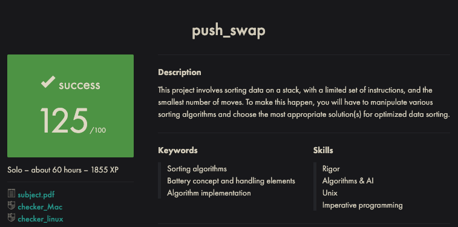

# Push_Swap



## Table of Contents

- [Introduction](#introduction)
- [Installation](#installation)
- [Usage](#usage)
- [Implementation](#implementation)
  - [Parsing Data](#parsing-data)
  - [Best Friend Algorithm](#best-friend-algorithm)
- [Checker](#checker)
- [Tips](#tips)
- [Resources](#resources)

## Introduction

A 42 School Lisboa project to create a sorting algorithm.

A list of arguments of type int are added in the order they are given into `stack a`. With the help of an additional stack, `stack b` which is empty to begin with, the objective is to sort the values so they are in ascending order in `stack a`.

The operations available are:

- `sa` (swap `a`) - swap the first 2 elements at the top of stack `a`.  
Do nothing if there is only one or no elements.
- `sb` (swap `b`) - swap the first 2 elements at the top of stack `b`.  
Do nothing if there is only one or no elements.
- `ss` - `sa` and `sb` at the same time.
- `pa` (push to `a`) - take the first element from the top of `b` and put it at the top of `a`.  
Do nothing if `b` is empty.
- `pb` (push to `b`) - take the first element at the top of a and put it at the top of `b`.
Do nothing if `a` is empty.
- `ra` (rotate `a`) - shift all elements in `stack a` up by 1.  
The first element becomes the last one.
- `rb` (rotate `b`) - shift all elements in `stack b` up by 1.  
The first element becomes the last one.
- `rr` - `ra` and `rb` at the same time.
- `rra` (reverse rotate `a`) -  shift down all elements of stack `a` by 1.
The last element becomes the first one.
- `rrb` (reverse rotate `b`): Shift down all elements of stack `b` by 1.
The last element becomes the first one.
- `rrr` - `rra` and `rrb` at the same time.

Complexity is important in this project but only in terms of number of operations, not time or comparisons.

The bonus section involves creating a checker program to determine whether a list of operation commands will sort a given list of numbers.

## Installation

Git clone the repository:

```shell
https://github.com/TimHopg/42-Push-Swap.git
```

Run `make` from within the directory.

`make bonus` will create the checker program.

`make clean` will remove object files.

`make fclean` will remove program and object files.

## Usage

```shell
./push_swap [ARGS]
```

Arguments can be given as one string, `"1 4 2 3 etc."` or as a number of individual args.

## Implementation

### Parsing Data

Parsing the arguments was the first step. A modification of `atoi()` had to be made to treat any leading or trailing invalid chars as an invalid argument. i.e. ,,multiple `+` or `-` and not to consider a lone `+` or `-` as `0`. `INT_MIN -1` and `INT_MAX + 1` should also be treated as invalid. There must be no duplicates.

The initial approach attempted was the "mechanical Turk" but I felt a lot of this was too hard-coded and felt like it was straying from an "algorithm" so I used a modification of a "best friend" algorithm instead.

Linked lists were used as the data structure for each stack since their properties were most pertinent to the brief.

### Best Friend Algorithm

Inspired by [Duarte3333](https://github.com/duarte3333/Push_Swap)'s implementation. With some tweaks and improvements to increase eficiency, you might want to call it _BFF algorithm_.

While `stack a` has more than 5 elements, the top element of `a` should be popped to `b` if it is lower than the mean of the list. If it is not, `a` should be rotated.

The fact we are allowed to iterate through the list and compare as often as we like makes most of these implementations inefficient measured any other way than by number of operations.

When `a` has only five elements remaining, `a` should be sorted into ascending order. This was achieved by hard coding a sorting algorithm for 3 elements (since there are few orientations) and then expanding that algorithm twice to accomodate 5. i.e. rotate until the smallest element is on the top, check it's not already sorted then pop to `b`. Rotate until the smallest element is on the top once more, check it's not already sorted then pop to `b`. Sort three, then pop from `b` to `a` twice.

The best friend element involves finding the number in `b` that is larger than but as close to each number in `a`. For instance, the best friend of `3` in `a` would be `4` (since there are no duplicates). If `4` doesn't exist in `b`, it would be `5` then `6` and so on.

Once each element in `a` has found their best friend, the program must calculate the _cost_ of rotating both stacks so both of these elements are at the top. Bear in mind that both stacks can be rotated in the same direction simultaneously at a cost of one operation, so if both are near the top or bottom, it is likely to be more cost eficient than if one was near the top and another was near the bottom (since these could not share operations).

This part of the implementation took the most thought, working out if each element required positive or negative rotations. Once the _best_ best friend is found (the cheapest), the operation is performed and then repeated until `b` is empty.

The final phase is to rotate `a` until the smallest element is on the top. It should then be sorted.

## Checker

A checker was provided by the subject and for the bonus part we had to create our own with similar functionality.

The checker takes a list of arguments which are parsed into the stack (using the same parsing function as used in the mandatory part). Checker returns `Error` if an error is encountered. If the list is sorted, the prompt is returned. Errors are returned on `STDERR`.

Otherwise the program waits for operation instructions, separated by a newline. When all instructions have been entered (`Ctrl + D` EOF (end of file)) the checker returns `OK` if the list is sorted and `KO` if the instructions did not sort the list.

## Tips

- Checker: test for sorted list that doesn't match original list.
- Checker: test for bad op instruction + (sorted list || list length shorter than original).
- Checker: Make sure the sorted list is the same length as the original list.
- The following is a handy line to generate numbers between -1000 and -500 in a random order. Add `wc -l` to count number of operations:  
```ARG=`echo {-1000..-500}$'\n' | sort -R | tr "\n" " "` ; ./push_swap $ARG```

## Resources

- [Best Friend (Duarte3333)](https://github.com/duarte3333/Push_Swap)
- [Mechanical Turk (Medium)](https://medium.com/@ayogun/push-swap-c1f5d2d41e97)
- [Mechanical Turk (Ayogun)](https://github.com/ayogun/push_swap)
- [Visualiser](https://github.com/o-reo/push_swap_visualizer)
- [GeMartin99 Tester](https://github.com/gemartin99/Push-Swap-Tester/tree/master) - this expects `""` and `" "` to return `Error` (I consider this the correct behaviour (like the subject's `checker`))
- [Leo Fu Tester](https://github.com/LeoFu9487/push_swap_tester) - this expects `""` and `" "` to return prompt
